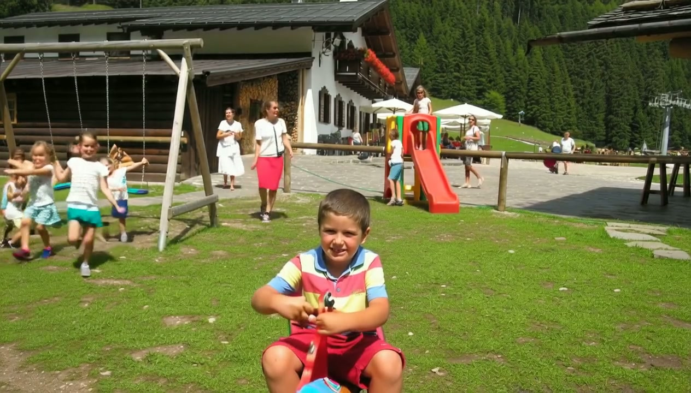
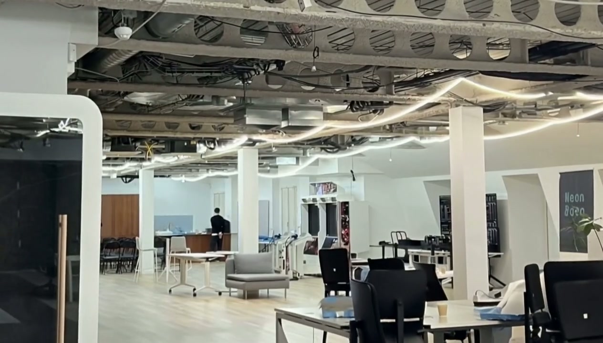

# Rewind

**Turn a photo into a world you can walk into, listen to, and talk with.**

## What is Rewind?

Rewind is an immersive "memory revisiting" app. Upload a photo, and the system transforms that moment into a navigable 3D memory world with ambient soundscapes and a gentle AI companion that guides you to relive and reflect on the memory.

## Demo

| Alpine Village | Coastal Lighthouse | Office Space |
|---|---|---|
| [](https://github.com/inin-zou/Rewind/blob/main/demo_videos/demo_IMG_1161.mp4) | [](https://github.com/inin-zou/Rewind/blob/main/demo_videos/demo_IMG_6436.mp4) | [](https://github.com/inin-zou/Rewind/blob/main/demo_videos/demo_IMG_8251.mp4) |
| *Click to play* | *Click to play* | *Click to play* |

> Upload a photo, walk through it with WASD, hear the ambient sounds, and talk with an AI companion about your memory.

## How It Works

1. **Upload a Memory** — Pick a photo and describe the moment.
2. **3D World Generation** — LingBot-World (Wan2.2) reconstructs the scene into an explorable 3D environment via camera-controlled video generation.
3. **Walk Through Your Memory** — Move freely with WASD/arrow keys to explore the scene from different angles.
4. **Ambient Soundscape** — OpenAI analyzes the scene, then ElevenLabs generates a looping sound effect that matches the environment.
5. **AI Companion** — A warm, voice-based AI companion greets you and guides you through the memory with reflective questions. Speak back using your microphone for a natural conversation.

## Architecture

```
Photo Upload
    |
    +---> fal.ai nano-banana (16:9 conversion)
    |         |
    |         v
    +---> Modal / LingBot-World (4x A100-80GB)
    |         |
    |         v
    |     Video (navigable 3D world)
    |
    +---> OpenAI GPT-4o-mini (scene analysis)
    |         |
    |         v
    |     ElevenLabs (looping ambient sound effect)
    |
    +---> AI Companion
              |
              +---> Gradium STT (speech-to-text)
              +---> OpenAI GPT-4o-mini (conversational LLM)
              +---> Gradium TTS (text-to-speech)
```

## Tech Stack

| Component | Technology |
|---|---|
| **Frontend** | React + TypeScript + Vite + Tailwind CSS (Lovable) |
| **Backend** | FastAPI (Python) |
| **3D World Generation** | LingBot-World (Wan2.2 i2v-A14B) on Modal (4x A100-80GB) |
| **Image Preprocessing** | fal.ai nano-banana (aspect ratio conversion) |
| **Scene Analysis** | OpenAI GPT-4o-mini (vision) |
| **Ambient Sound** | ElevenLabs Sound Generation API |
| **AI Companion STT** | Gradium Speech-to-Text |
| **AI Companion TTS** | Gradium Text-to-Speech |
| **AI Companion LLM** | OpenAI GPT-4o-mini |

## Getting Started

### Prerequisites

- Python 3.10+
- Node.js 18+
- API keys for: OpenAI, ElevenLabs, fal.ai, Gradium, Modal

### Backend

```bash
cd backend
cp .env.example .env  # Add your API keys
python -m venv .venv && source .venv/bin/activate
pip install -r requirements.txt
pip install openai fal_client pillow
uvicorn main:app --port 8000
```

### Frontend

```bash
cd frontend
npm install
npm run dev
```

### Modal Deployment (3D World Generation)

```bash
cd modal-deploy
modal deploy lingbot_world.py
```

### Running Tests

```bash
cd backend
.venv/bin/python -m pytest test_sound.py test_companion.py -v
```

## API Endpoints

| Method | Endpoint | Description |
|---|---|---|
| POST | `/api/generate` | Generate 3D world video from image |
| POST | `/api/generate-sound` | Analyze image and generate ambient sound |
| POST | `/api/companion/greet` | Generate AI companion greeting |
| POST | `/api/companion/chat` | Voice conversation turn (STT -> LLM -> TTS) |
| GET | `/api/health` | Health check |

## Vision

Memories are more than images — they are places, sounds, and feelings. Rewind lets you step back into those moments, not just to see them, but to feel them again and find meaning in them.
